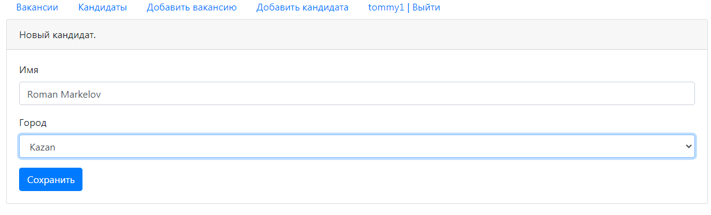
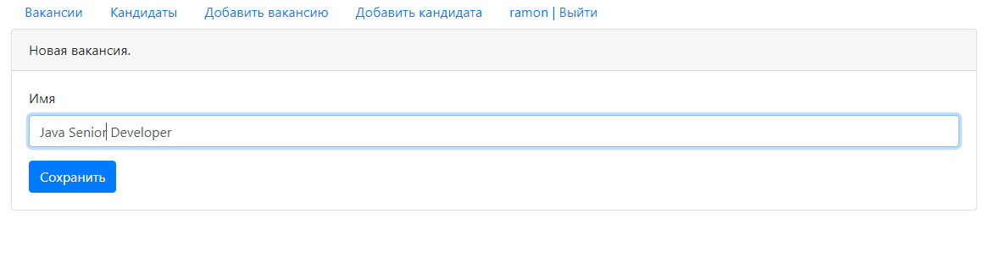
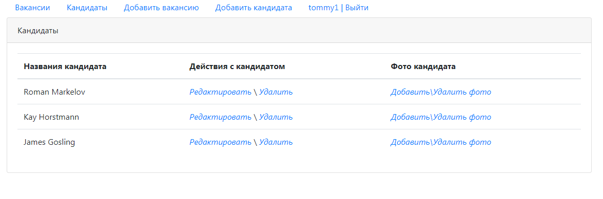
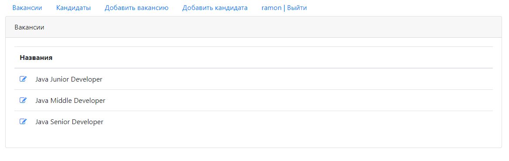
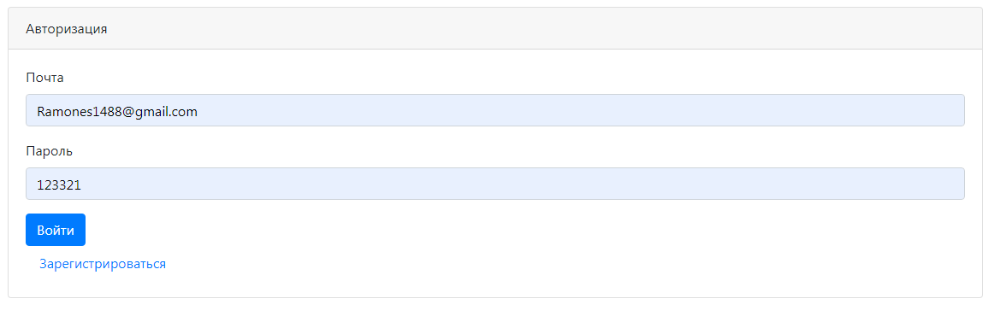
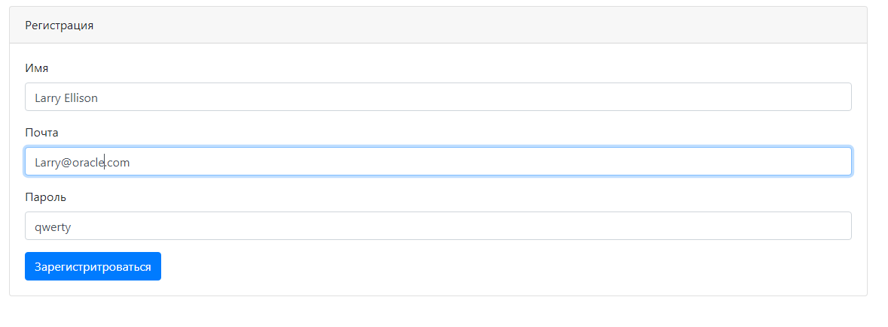
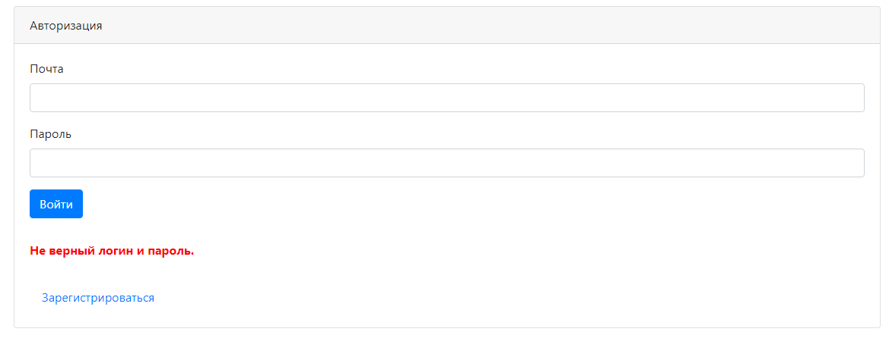

# Проект "Dream Job"

* [Описание](#описание)
* [Функционал](#функционал)
* [Технологии](#технологии)
* [Интерфейс](#интерфейс)
* [Автор](#автор)

## Описание
CRUD-MVC приложение на сервлетах и JSP, реализующее простую биржу
вакансий и кандидатов.
Можно добавлять/изменять данные по каждой вакансии и кандидату.
По кандидатам так же поддерживается хранение фотографии.

## Функционал
* Регистрация пользователя
* Аутентификация на сервлет-фильтрах
* Авторизация через БД PostgreSQL
* Добавление/изменение вакансий
* Добавление/изменение соискателей
* Добавление/изменение/скачивание фотографии соискателя
* Две молдели хранения данных MemStore PsqlStore

## Технологии
* Java14
* JDBC
* PostgreSQL
* Servlet&JSP&JSTL
* HTML, CSS, BOOTSTRAP, JS, AJAX, JQUERY
* Apache Tomcat Server
* Junit, Mockito, Powermock
* Log4j
* Apache Commons Fileupload

* Добавление кандидата

* Добавление вакансии

* Список кандидатов 

* Список вакансий 

* Авторизация

* Регистрация

* Проверка подлиности пароля

## Автор

Маркелов Роман Игоревич

Java-разработчик

roman.sercent@gmail.com

+79178764086

